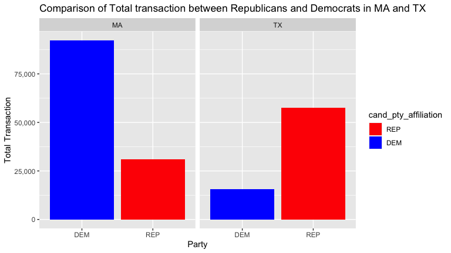
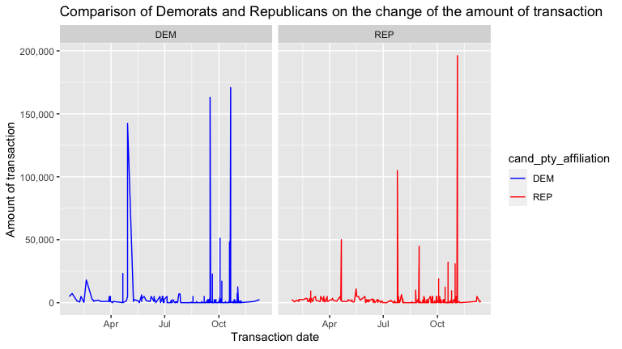

Republicans &Democrats: Follow the money
================

# Summary

We follow the money through the change of time, party affiliation, and
states. In the first visualization, the total transaction between
Republicans and Democrats is compared between two states: UT and MA. The
second visualization traces the amount of transactions as the time
changes between Republicans and Democrats, which indicates the timing
when the transaction reaches its peak. The main focus of these
visualizations is the money, more specifically where the money is going
and when it is being given at the highest rates. The graphs show the
transaction totals in relation to these specifications, following the
money in them.

## Comparison of Total transaction between Republicans and Democrats in MA and TX

In this visualization, we are shown the difference in total transactions
between Massachusetts and Texas, differentiated by the two main
political parties, in a faceted bar graph. These states were chosen
because Massachusetts is typically regarded as more of a Democrat state
and Texas more Republican, and the graphs reflect that in how both made
more transactions in favor of those respective political parties.
Massachusetts in particular made a lot more transactions in favor of the
Democrat party, and Texas, though not contributing as much money to
either party overall, also made noticeably more transactions in favor of
the Republican party.

The purpose of this visualization is to show how these two states have
made very different decisions when it comes to who exactly they are
sending their money to. The overall total transactions made by
Massachusetts seems to be higher than the overall total transactions
made by Texas, suggesting that Massachusetts had a heavier investment in
the 2016 election than Texas did.

Overall, the visualization shows a distinct difference in where
transactions go depending on state and political party for Massachusetts
and Texas, as well as a difference in how much they sent to the
country’s two main political parties. Their statuses as Democrat and
Republican states respectively do seem to ring true given how their
donations were for the most part sent towards those parties, though it
was surprising to see Massachusetts with more overall transactions than
Texas given their smaller population and ability to swing an election.

<!-- -->

## Comparison of Demorats and Republicans on the change of the amount of transaction based on time period

The line graph shows the difference in the total transaction as the time
proceeds to the election date between Democrats and Republicans from
January 21st, 2016 to December 14th, 2016. On November 8th, 2016, the
election day, the amount of transactions of both parties reached its
peak, and the Republicans had a higher maximum value of transactions
than Democrats. This difference contributed to the result of the
election that Republicans won the election. We may also notice that
there are sudden increases in timing except for the election day for
both parties. This change indicates that whatever the event was
happening around May for Democrats and July for Republicans, it would be
closely related to money.

Overall, the trend of the amount of transaction in both Democrats and
Republicans follows our expectation: as the time gets closer to the
election date, the more the transaction is made, and the amount of money
transacted dropped dramatically as the election date was passed. More
specifically, same as our deduction, since Republicans won the election
in 2016, the amount of transactions of Republicans on the election date
is higher than that of Democrats. Also, the election date is not the
only event that causes a greater amount of transactions, other events
happening may also count as an important factor to the money flow. In
conclusion, the visualization allows us to deduct whether the events
happening on a specific date have an influence on the amount of money
transacted, and therefore, deduct which events have a close relation to
money.

<!-- -->
